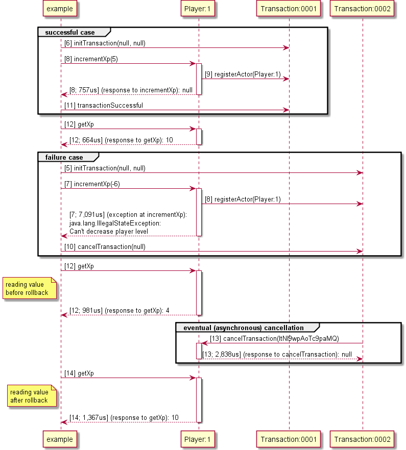

Orbit Transactions
==================

The standard orbit transaction offers a way to asynchronously cancel transactions.

The transaction initiator creates a new `Transaction` actor.
All actors involved in the transaction notify the `Transaction` actor.
If the transaction fails the `Transaction` actor sends the `cancelTransaction` message to all participants.

Sample transaction flow:





Event source transactions
-------------------------

Orbit comes with the `EventSourceActor`, one optional actor implementation that can revert transactions using event sourcing.
The use of `EventSourceActor` is not mandatory. The application is free to implement it's own transaction cancellation logic. 

Event sourced actors should perform state modifications only through replayable events defined in the state class.

```java
public class BankActor extends EventSourceActor<BankActor.BankState> implements Bank 
{
	public static class BankState extends EventSourceState 
	{
		long balance;
		
		@TransactionalEvent
		void modifyBalance(int amount) 
		{
			balance += amount;
			return Task.done();
		}		
	}
	
	public Task giveMoney(int amount) 
	{
		checkPositiveAmount(amount);
		state().modifyBalance(amount);
		return Task.done();
	}

	public Task takeMoney(int amount) 
	{
		checkPositiveAmount(amount);
		if(state.balance < amount) { 
			throw new NotEnoughFundsException();
		}
		state().modifyBalance(-amount);
		return Task.done();
	}
	// ...
}

public Task buyItem(Item item, long cost) {
	return Transaction.transaction( () -> 
	{
		Task bankTask = bank.takeMoney(cost);
		Task inventoryTask = inventory.giveItem(item);
		return Task.allOf(bankTask, inventoryTask);
	});
}
```


Inner workings
--------------

When a transaction starts, a new `Transaction` actor is notified of the transaction start.

The transaction reference is added to the current TaskContext making it visible to all 
asynchronous processes happening inside its context.
 
All messages called from within the transaction context carry the transaction reference with them (in a header).
The actors processing messages originated from the transaction context will have the transaction reference in their local TaskContext.
(TaskContext is analogous to a ThreadLocal map and is accessible from all async listeners created with `com.ea.orbit.concurrent.Task`)

If an actor is executing a piece of transactional logic it should notify the transaction of its participation.

When a transaction completes successfully the initiator should notify it. The transaction then gets marked for deletion. 

If the transaction fails the it's usually then initiator notifies the `Transaction` actor. 


Nested transactions
-------------------

When a new transaction is being created the current TaskContext is inspected to check if there is another transaction
in operation. If that is the case the nested transaction will notify the parent during it's initialization.

The parent transaction records it's immediate child transactions. If the parent transaction is cancelled it invokes 
the cancellation method in the sub transactions.


Asynchronous transactions
----------------------------

The cancellation process is fully asynchronous meaning that eventually all the involved actors will 
be notified of the cancellation but there is no object (Task, future, promise) 
to check when the cancellation is done.   


Examples
--------

Transaction involving 3 actors: store, bank, and inventory.


Failed transaction involving the same 3 actors.
The asynchronous canceling eventually restores the original actor state.


